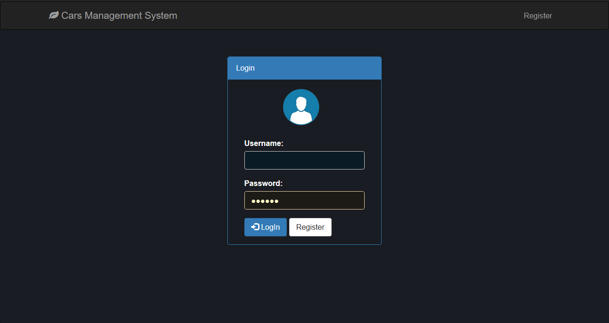
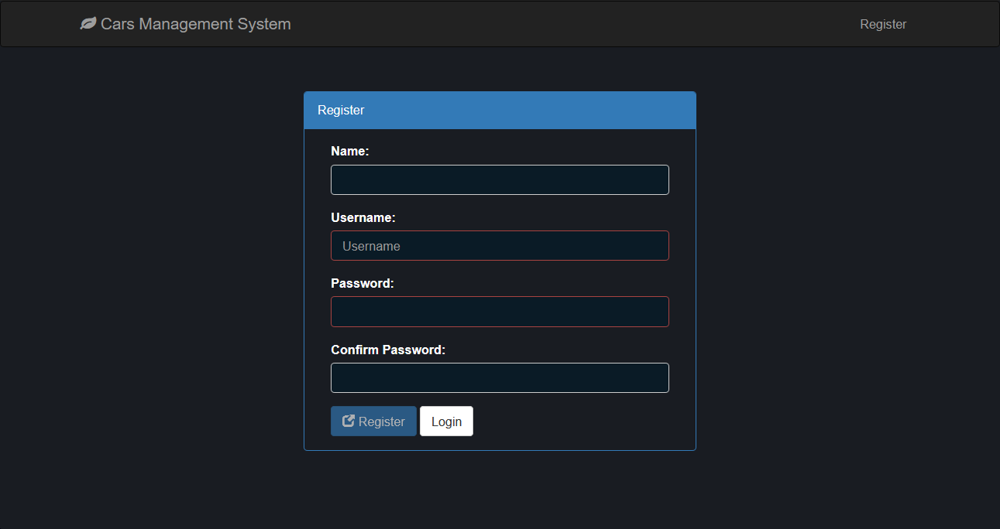
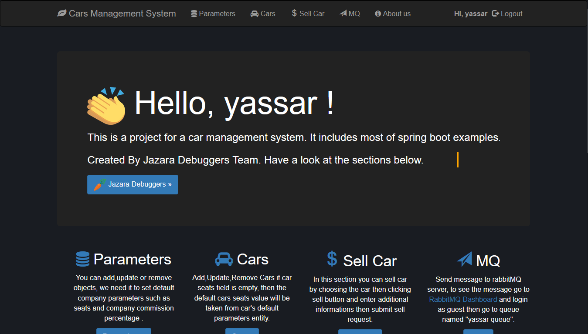
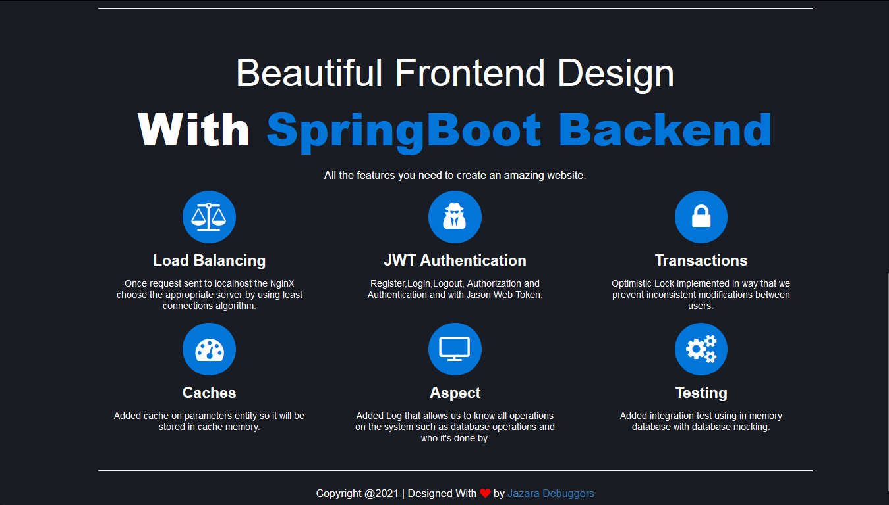
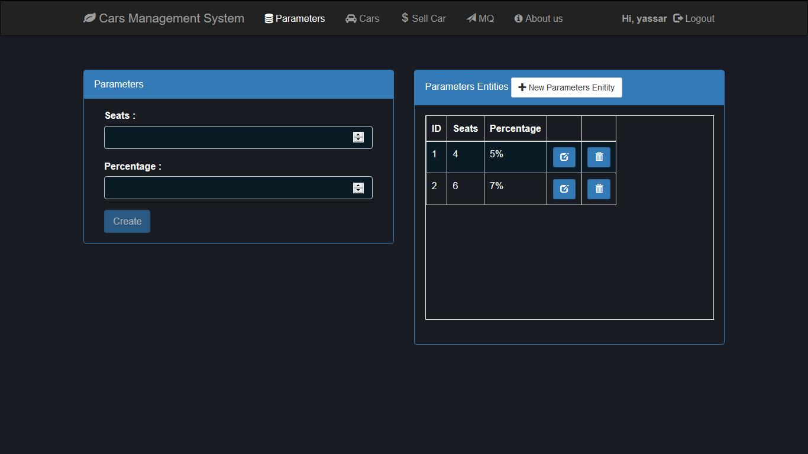
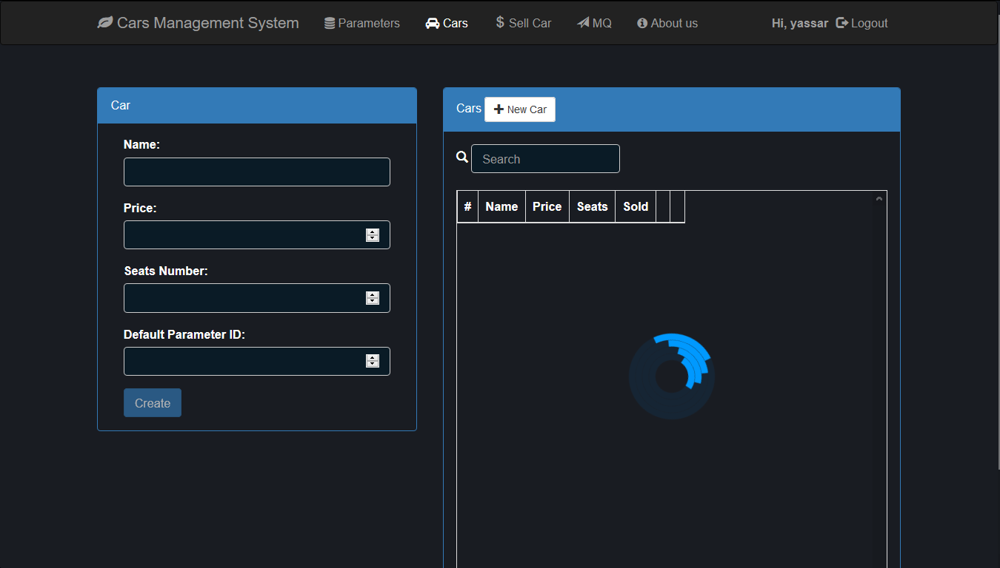
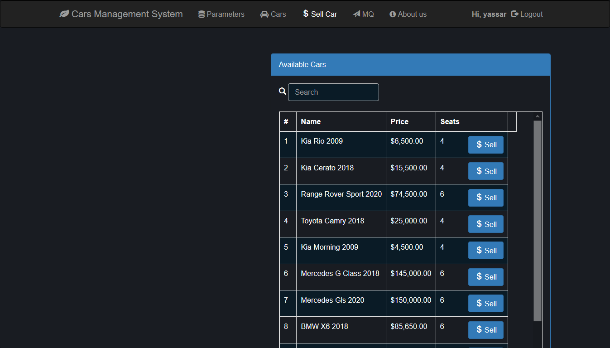
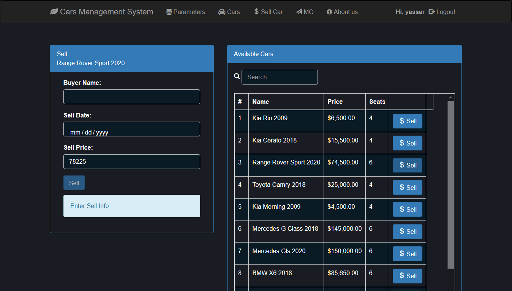

<!-- PROJECT SHIELDS -->
<!--
*** I'm using markdown "reference style" links for readability.
*** Reference links are enclosed in brackets [ ] instead of parentheses ( ).
*** See the bottom of this document for the declaration of the reference variables
*** for contributors-url, forks-url, etc. This is an optional, concise syntax you may use.
*** https://www.markdownguide.org/basic-syntax/#reference-style-links
-->
[![MIT License][license-shield]][license-url]
[![LinkedIn][linkedin-shield]][linkedin-url]

:star: Star us on GitHub — it helps!
<!-- PROJECT LOGO -->
 

  

  <h3 align="center">Cars Management System</h3>

  

     Beautiful Frontend Design With SpringBoot Backend ! Created By Jazara Debuggers Team.
     
    <a href="https://github.com/Yassarooo/SpringBootRestful/"><strong>Explore the docs »</strong></a>
     
     
    <a href="https://networkapplications.herokuapp.com">View Demo</a>
  

<!-- TABLE OF CONTENTS -->

  
Table of Contents

  <ol>
    <li>
      <a href="#about-the-project">About The Project</a>
      <ul>
        <li><a href="#screenshots">ScreenShots</a></li>
      </ul>
      <ul>
        <li><a href="#built-with">Built With</a></li>
      </ul>
    </li>
    <li><a href="#usage">Usage</a></li>
    <li><a href="#contributing">Contributing</a></li>
    <li><a href="#license">License</a></li>
    <li><a href="#contact">Contact</a></li>
  </ol>

<!-- ABOUT THE PROJECT -->
## About The Project
Here's Some of major features the project has :
* Register,Login,Logout -> Authorization and Authentication and with Jason Web Token.
* Database Operations -> You can add,update or remove objects without need to setup database. 
* Responsive Design -> it can be fit most of screen sizes.
* Transactions -> Optimistic Lock implemented in way that we prevent inconsistent modifications between users.
* Aspect -> Added Log that allows us to know all operations on the system such as database operations and who it's done by.
* Testing -> Added integration test using in memory database with database mocking.
* Cache -> Added cache on parameters entity so it will be stored in cache memory for fast access.
* Message Queue -> Send message to rabbitMQ servermessages will be sent to queue named "yassar queue".

<!-- screenshots -->
### ScreenShots

### Login,Register
 
  
   
  
  ### Home
 
  
   
  
  ### Parameters,Cars
 
  
   
  
  ### Sell Car
 
  
   

### Built With

* [Spring Boot](https://spring.io/projects/spring-boot)
* [AngularJs](https://angularjs.org)
* [Bootstrap](https://getbootstrap.com)
* [JQuery](https://jquery.com)

<!-- USAGE EXAMPLES -->
## Usage

Many Companies can use this project as product management such as shopping store, cars store, animals store or any store that depends on selling products.
Also, it can be optimized and you can add more features according to the way it will be used.
For any ideas that comes to you, contributing is opened !

<!-- CONTRIBUTING -->
## Contributing

Contributions are what make the open source community such an amazing place to be learn, inspire, and create. Any contributions you make are **greatly appreciated**.

1. Fork the Project
2. Create your Feature Branch (`git checkout -b feature/AmazingFeature`)
3. Commit your Changes (`git commit -m 'Add some AmazingFeature'`)
4. Push to the Branch (`git push origin feature/AmazingFeature`)
5. Open a Pull Request

<!-- LICENSE -->
## License

Distributed under the MIT License. See `LICENSE` for more information.

<!-- CONTACT -->
## Contact

Yassar Hammami - [@your_twitter](https://twitter.com/yassarooo) - yassarhammami@gmail.com

Project Link: [https://github.com/Yassarooo/SpringBootRestful](https://github.com/Yassarooo/SpringBootRestful)

<!-- MARKDOWN LINKS & IMAGES -->
<!-- https://www.markdownguide.org/basic-syntax/#reference-style-links -->
[license-shield]: https://img.shields.io/github/license/othneildrew/Best-README-Template.svg?style=for-the-badge
[license-url]: https://github.com/Yassarooo/SpringBootRestful/blob/master/LICENSE.txt
[linkedin-shield]: https://img.shields.io/badge/-LinkedIn-black.svg?style=for-the-badge&logo=linkedin&colorB=555
[linkedin-url]: https://linkedin.com/in/yassar-hammami-0ab88b11b

